# Serverless REST Assignment
**Name:** Elizabeth Neary

This repository contains an implementation of a serverless REST API for the AWS platform. The CDK framework is used to provision its infrastructure. The API's domain context is movie reviews. With this API domain, I needed to complete and implement GET, POST, and PUT requests for various endpoints such as getting reviews for all movies, reviews by rating, by year, by reviewer name, and updating the contents of reviews of movies. Along with implementing these endpoints, authentication was also implemented to allow a user to sign up, confirm sign up, and sign in into the application, allowing some endpoints to be protected or authenticated unless the user is signed up and signed in into the application. When a `cdk deploy` is performed, the AuthAPI Stack is present in the AWS CloudFormation console, showing the successful launch of the CDK framework. 

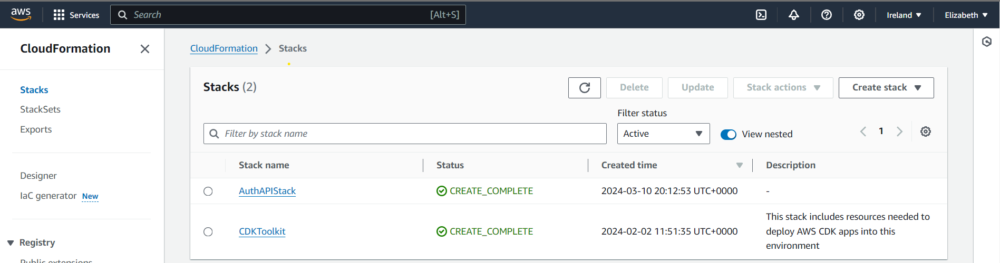

## API endpoints
Using the same AuthApi URL and AppApiUrl, I was able to retrieve these endpoints successfully and retrieve the correct results.

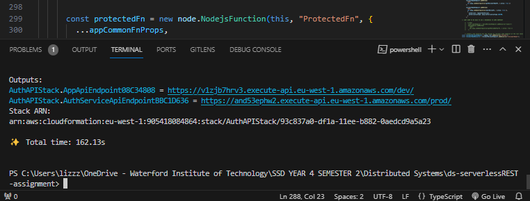

The endpoints that I was able to successfully retrieve are as follows:
- `POST /movies/reviews` - add a movie review. Authentication added. 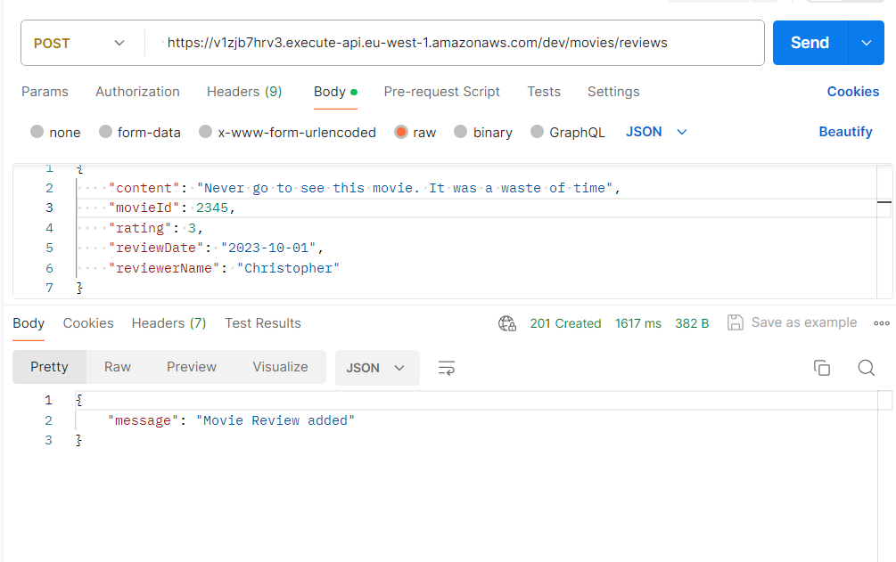
- `GET /movies/{movieId}/reviews` - Get all the reviews for the specified movie. 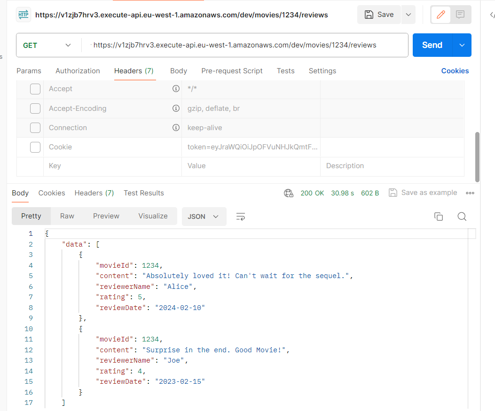
- `GET /movies/{movieId}/reviews?minRating=n` - Get the reviews for the specified movie with a rating greater than the minRating. 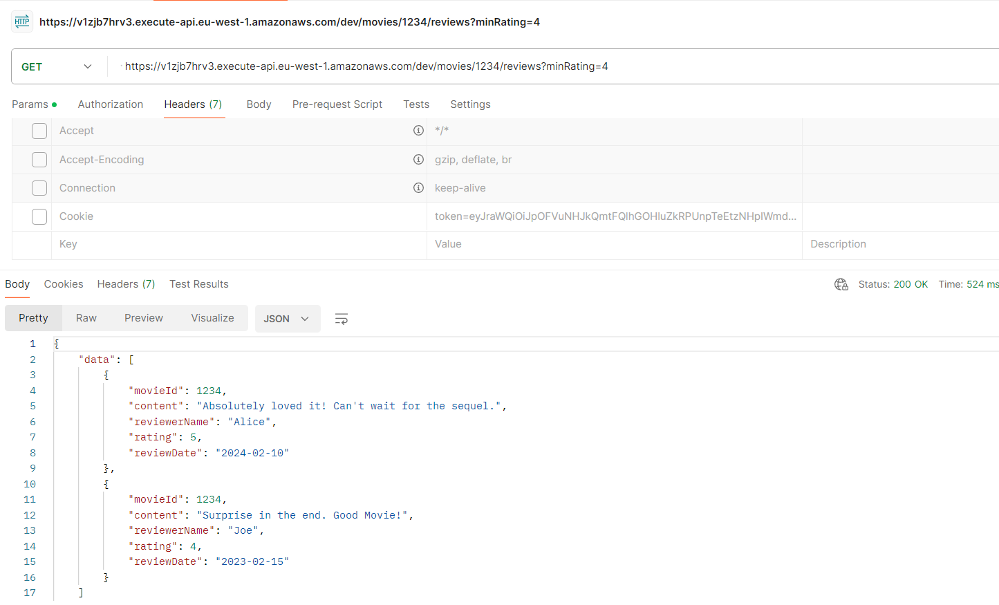
- `GET /movies/{movieId}/reviews/{reviewerName}` - Get the review written by the named reviewer for the specified movie. 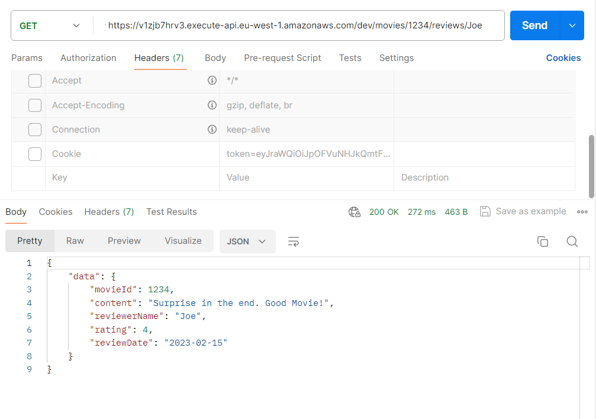
- `PUT /movies/{movieId}/reviews/{reviewerName}` - Update the text of a review. Authentication added. 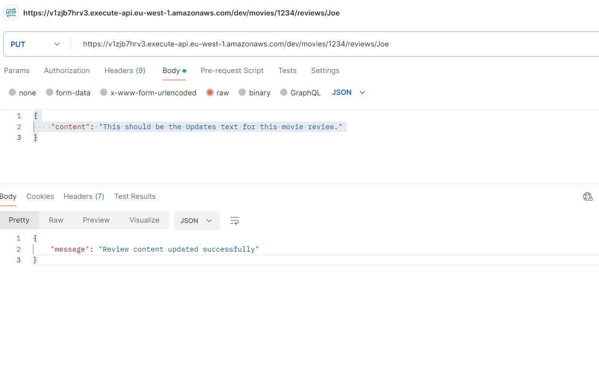 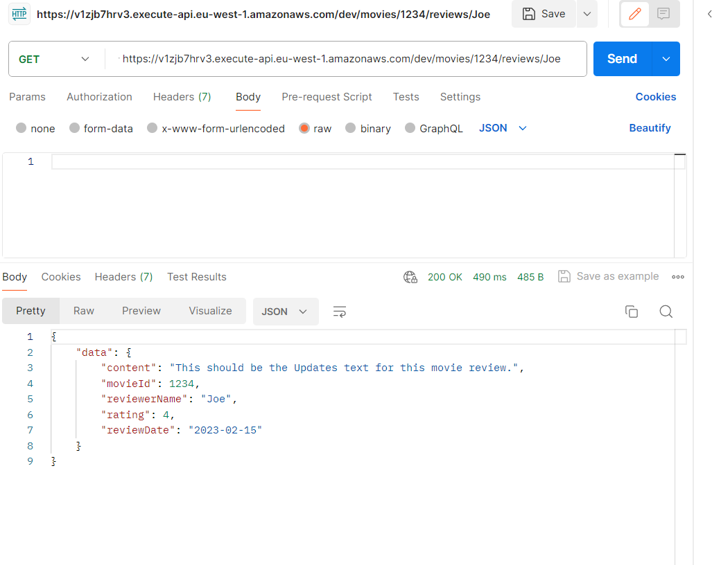
- `GET /reviews/{reviewerName}` - Get all the reviews written by a specific reviewer. 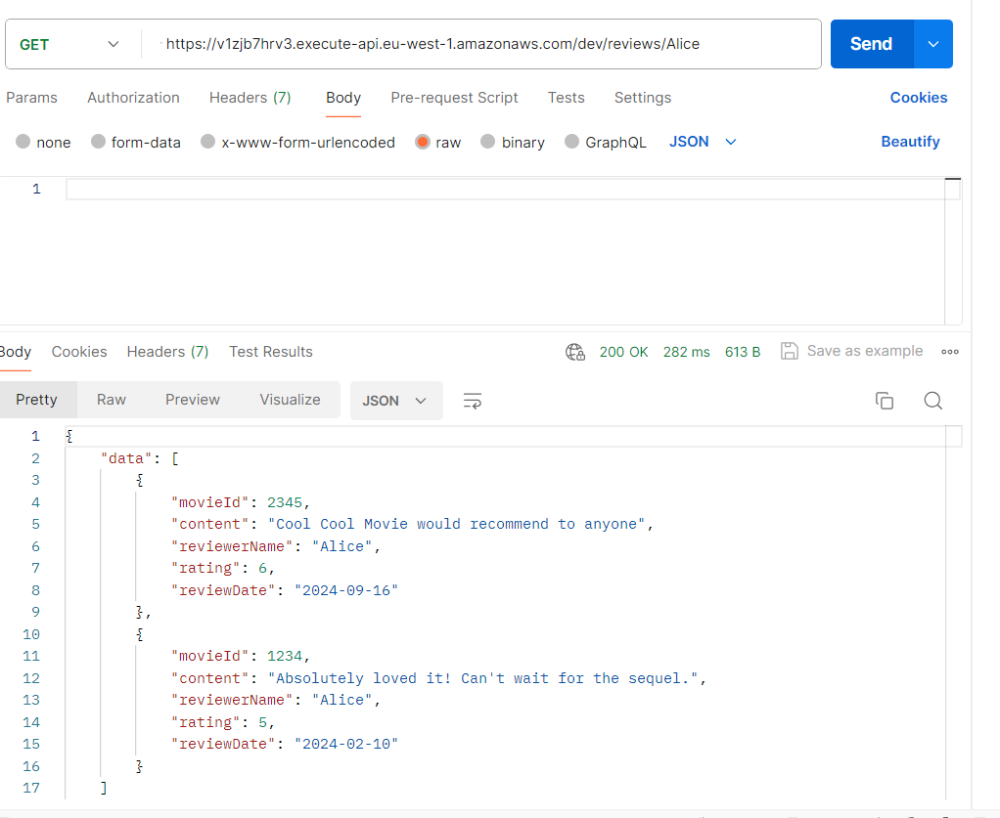

## Authentication
Authentication was successfully implemented into the application, and thus uthorization was added to the POST and PUT requests for movie reviews (Added to DELETE movie but not in assignment). Other requests such as GET are not authenticated and can be accessed without authorization. When the app is deployed, 2 URLs are seen. One for AuthAPI containing the authentication and sign-in code and AppApi containing the movie review code. Using the AuthApi URL and when a user has successfully signed up and confirmed their sign-up with the verification code, a token becomes available in the cookies tab in POSTMAN. This token is then used in the Header tab in POSTMAN to allow access to the authorized endpoints, POST and PUT requests in the application using the AppApi URL. If the token is not used for POST and PUT requests , you will be unauthorized to do the request. The GET requests can be doen without this cookie token.

In order to be able to sign up for the application, I needed to create an email identity. In the AWS Console page, in the navigation pane, under Configuration and under Verified identities, I created a new identity using an email address as the identity type I wanted to use that I would be able to have access and receive emails from. During the signup process in the cdk application, when a verification code is sent, it verifies the identity type or the email address used to sign up and becomes verified. When the application is deployed with Authentication applied successfully, a UserPool is created in the AWS Cognito Console.

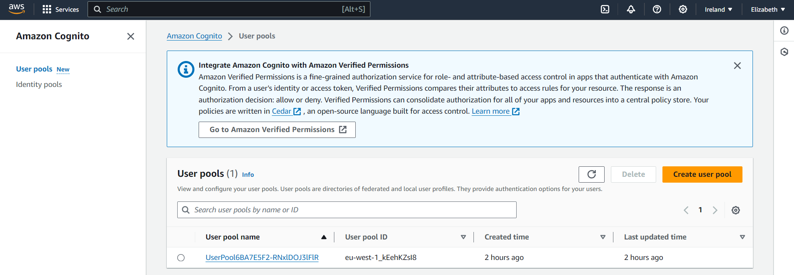

When the UserPool is clicked, it shows the User I used to sign up with in order to use the application, shown with a green verified indicator showing that the user I used to sign up with has been verified to use the CDK stack application. 

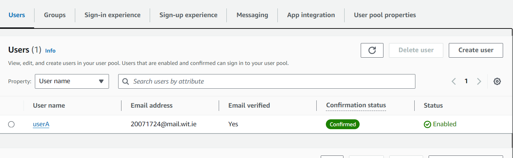

### Authentication Endpoints 
Using the same URL `https://and53ephw2.execute-api.eu-west-1.amazonaws.com/prod/`, I was able to sign up and signup, confirm signup and sign-in into the application. Below are screenshots of the process and the responses and the Authentication endpoints being used.

- **Sign Up** 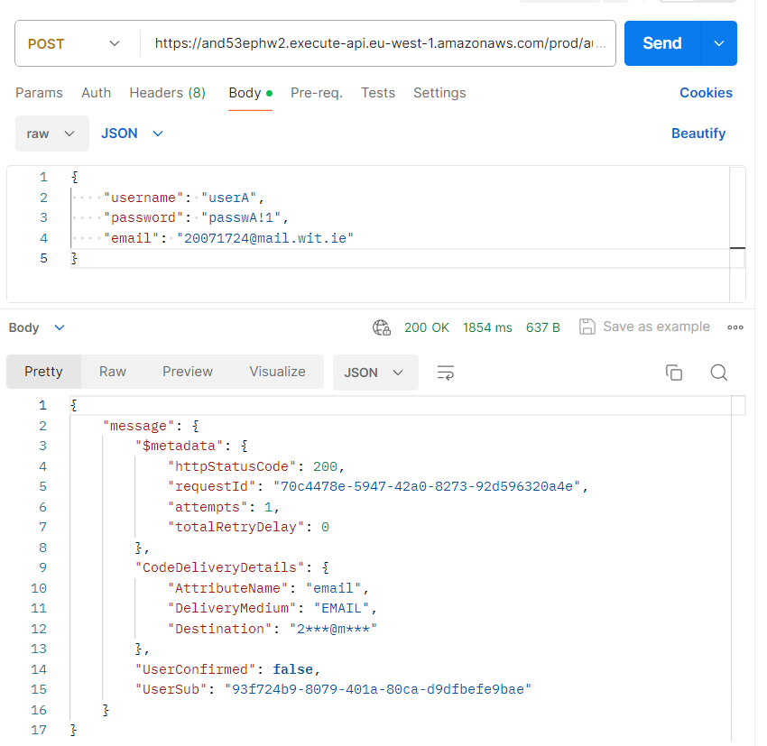
- **Confirm SignUp** 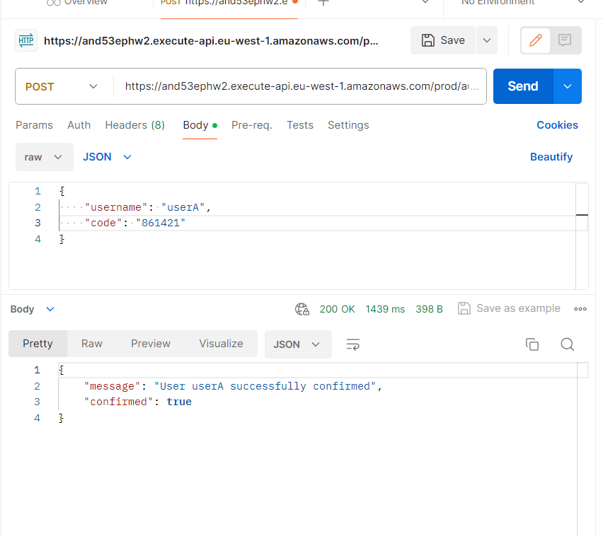
- **Sign In** 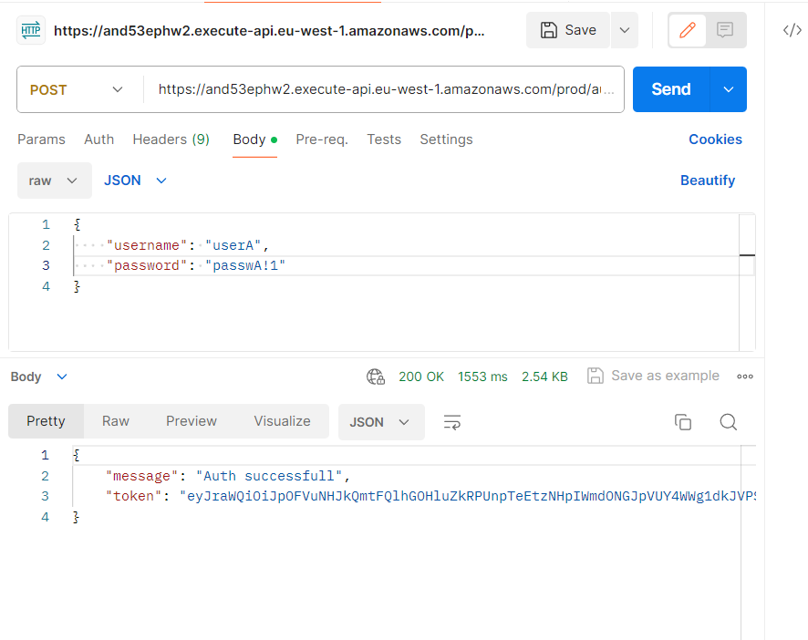
- **Protected using AppApi URL** 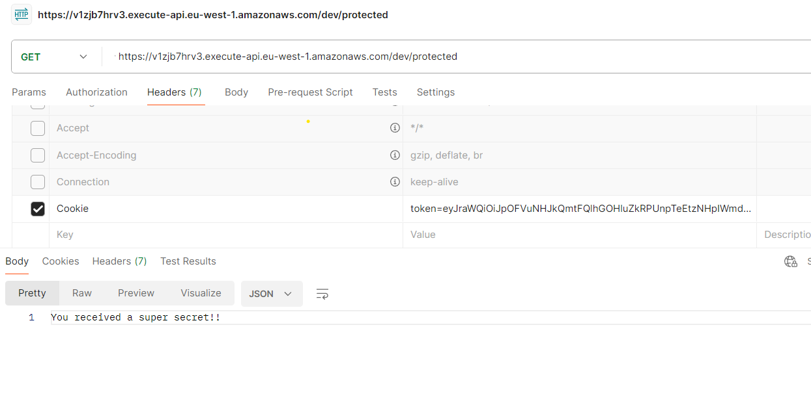
- **Public using AppApi URL** 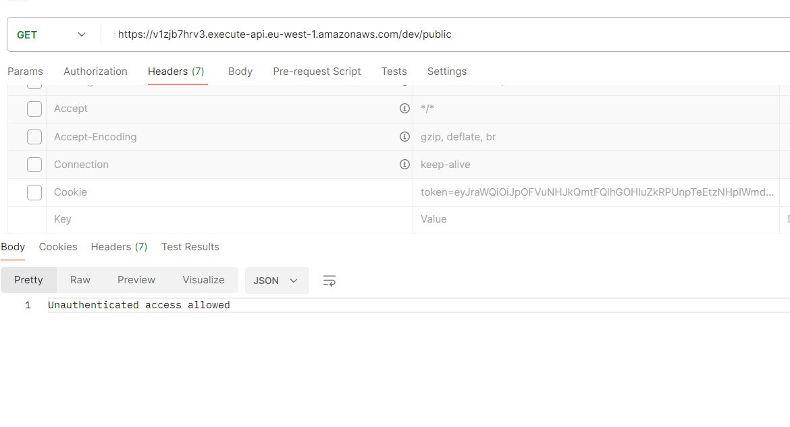
